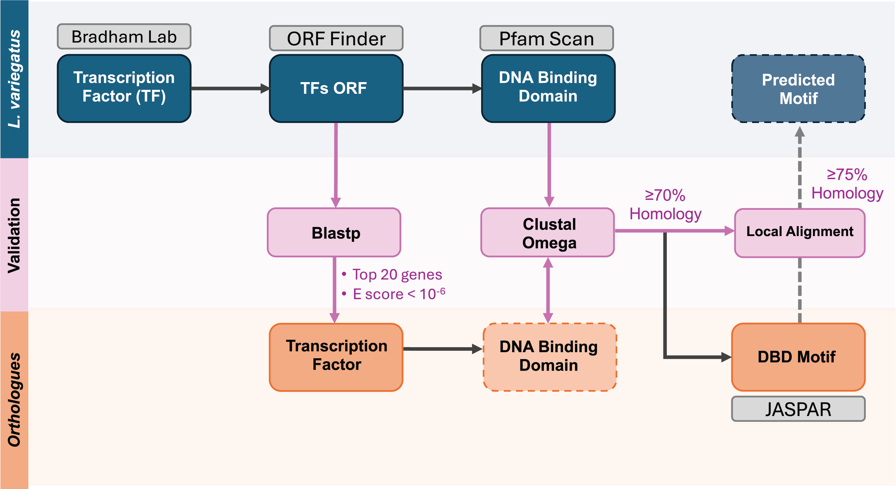

# Lverage (WIP)
Motif Finder pipeline - searching for motifs through orthologous species.



## Install Requirements

### Preparing the Directory
Prepare a directory for Lverage. Then either download the ZIP file or clone the repository to this directory. Once downloaded, navigate inside.
```
git clone https://github.com/BradhamLab/Lverage.git
cd Lverage
```

### Python
Lverage requires Python3.8 at minimum to run. The tool was developed using Python3.10.12. To obtain python and the required libraries, we advise using Conda.

#### Downloading Conda
To install Conda, follow the instructions on their [website user guide](https://conda.io/projects/conda/en/latest/user-guide/install/index.html "https://conda.io/projects/conda/en/latest/user-guide/install/index.html"). We suggest downloading Miniconda.

#### Installing Python and Packages
The following command installs our configuration of Python.
```
conda env create -f conda_lverage.yml
conda activate lverage
```

#### Alternative
The user can also download Python and the required libraries themselves. Follow the instructions at the [Python website](www.python.org "www.python.org") to download Python3.10.12 (or any other alternative with a minimum of 3.8). 

Then the user must install the required libraries. Located in the repository is a requirements.txt file which contains the required libraries. Assuming that calling *python3* calls the user-downloaded python, please call the following command.

```
python3 -m pip install -r requirements.txt
```

### Clustal Omega
A ClustalOmega binary is also required. This can be obtained from the clustal [website](http://www.clustal.org/omega/ "http://www.clustal.org/omega/"). Download the pre-compiled binary that matches your system or compile the source code. Next, either add the binary to your PATH environment variable or when calling Lverage, provide the path to the binary with the appropriate argument.

## How to Use
We warn against moving any file within the directory anywhere else as this will create errors. If you wish to access from other places, we suggest appending the directory to your PATH environment variable, creating an alias, or creating a shortcut.

To call Lverage, ensure that the requirements above are all met. Within the directory is a file called *lverage.py*. All calls should be made with this file.

The following table shows all arguments for Lverage.


|Argument|Description|
|---|---|
|-h/--help| Provides a description of the tool and arguments |
|-db/--database| Path to database file |
|-mdb/--motif_database| Path to motif database to search; currently only JASPAR which is default|
|-or/--orthologs|Ortholog species to search through. Povide the NCBI Tax IDs or scientific names, each one enclosed in quotes and separated by spaces|
|-o/--output|Output file path; if a directory is provided, output.tsv will be made there|
|-c/--clustalo| Path to the clustalo executable. If not provided, assumed to be in PATH|
|-e/--email|Email address for EBML Tools|
|-v/--verbose|If provided, will print out every step along the way as well as intermittent reuslts|


