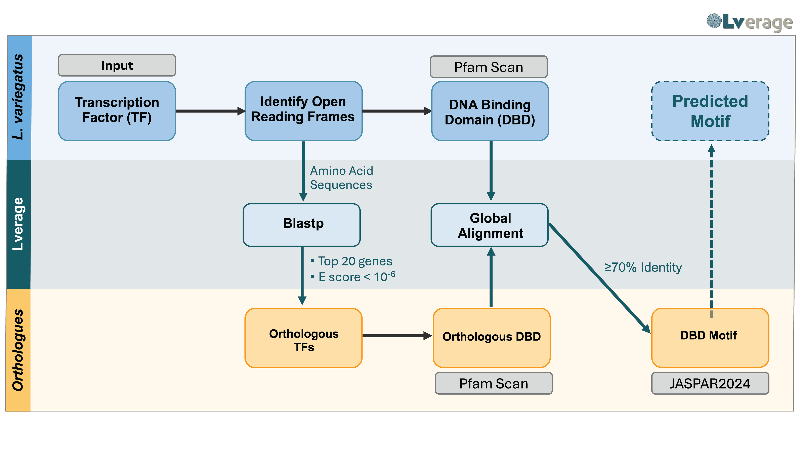

# Lverage (WIP)
Motif Finder pipeline - searching for motifs through orthologous species.



## Install Requirements

### Preparing the Directory
Prepare a directory for Lverage. Then either download the ZIP file or clone the repository to this directory. Once downloaded, navigate inside.
```
git clone https://github.com/BradhamLab/Lverage.git
cd Lverage
```

### Python
Lverage requires Python3.8 at minimum to run. The tool was developed using Python3.10.12. To obtain python and the required libraries, we advise using Conda.

#### Downloading Conda
To install Conda, follow the instructions on their [website user guide](https://conda.io/projects/conda/en/latest/user-guide/install/index.html "https://conda.io/projects/conda/en/latest/user-guide/install/index.html"). We suggest downloading Miniconda.

#### Installing Python and Packages
The following command installs our configuration of Python.
```
conda env create -f conda_lverage.yml
conda activate lverage
```

#### Alternative
The user can also download Python and the required libraries themselves. Follow the instructions at the [Python website](www.python.org "www.python.org") to download Python3.10.12 (or any other alternative with a minimum of 3.8). 

Then the user must install the required libraries. Located in the repository is a requirements.txt file which contains the required libraries. Assuming that calling *python3* calls the user-downloaded python, please call the following command.

```
python3 -m pip install -r requirements.txt
```

## How to Use
We warn against moving any file within the directory anywhere else as this will create errors. If you wish to access from other places, we suggest appending the directory to your PATH environment variable, creating an alias, or creating a shortcut.

To call Lverage, ensure that the requirements above are all met. Within the directory is a file called *lverage.py*. All calls should be made with this file.

The following table shows all arguments for Lverage.


|Argument|Description|
|---|---|
|-h/--help| Provides a description of the tool and arguments |
|-f/--fasta| Path to folder of fasta files. Each fasta file should be for a singular gene. A fasta file may contain multiple scaffolds of this gene in multi-FASTA format. The name of the file should be the gene's name. |
|-mdb/--motif_database| Motif database to search; currently only JASPAR which is default|
|-or/--orthologs|Ortholog species to search through. Povide the NCBI Tax IDs or scientific names, each one enclosed in quotes and separated by spaces|
|-o/--output|Output file path; if a directory is provided, output.tsv will be made there|
|-e/--email|Email address for EMBL Tools|
|-it/--identity_threshold| According to <insert paper here>, 70% similarity with an ortholog sequence means that the motif is conserved in the ortholog. This parameter asks that any ortholog sequence must be 70% similar to a provided gene's sequence.
|-v/--verbose|If provided, will print out every step along the way as well as intermittent reuslts|


### Examples

#### Calling Lverage on Green Sea Urchin

```
python3 lverage.py -f Data/LvGenes/ -e useremail@mail.com -o ../Output/lvedge_output.tsv -v
```
Here we provide a directory of fasta files with -f. The fasta files used in this example were gathered from LvEDGE and are provided in this repository. In -e, we provide an email for any EMBL tools. We provide a path for an output file we wish to be created with -o. Finally, we ask that it prints out each step with -v.


# Contributions

Lverage is an open-source tool made for the community. As such, we are welcoming of any contributions to the project!

If a bug/error is found, we suggest adding it as an issue in the GitHub Repository.

For directly contributing (fixing the error or adding new funcionality), we suggest that the contributor follows the (https://github.com/firstcontributions/first-contributions)[standard process]. Begin by forking the repository, making local changes, and then submit a pull request to the master branch. Be sure to name your branch a meaningful name that represents what changes you have added! We suggest that if a contributor wishes to add/fix multiple parts that they create a fork for each part.

Please note that this project uses the GNU AFFERO GENERAL PUBLIC LICENSE Version 3. Any contributions made will fall under this license.

# Contact Us

The team members are available to be contacted for any queries relating to **Lverage** usage and issues. We suggest first and foremost that any issue be posted to the issue board.

To contact us, please use the following contact information.


| Name               | Email               |
|--------------------|---------------------|
| Cynthia A. Bradham | cbradham@bu.edu     |
| Anthony B. Garza   | abgarza@bu.edu      |
| Stephanie Hao      | sphao@bu.edu        |
| Yeting Lee         | yetingli@bu.edu     |
| Nofal Ouardaoui    | naouarda@bu.edu     |
